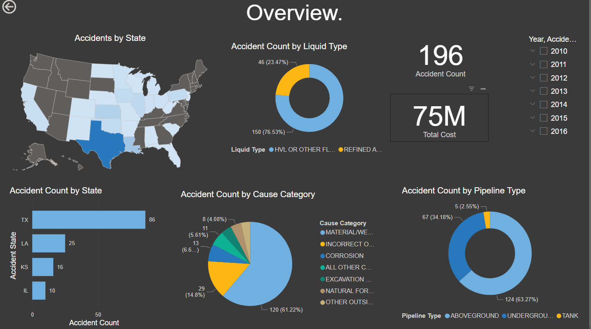
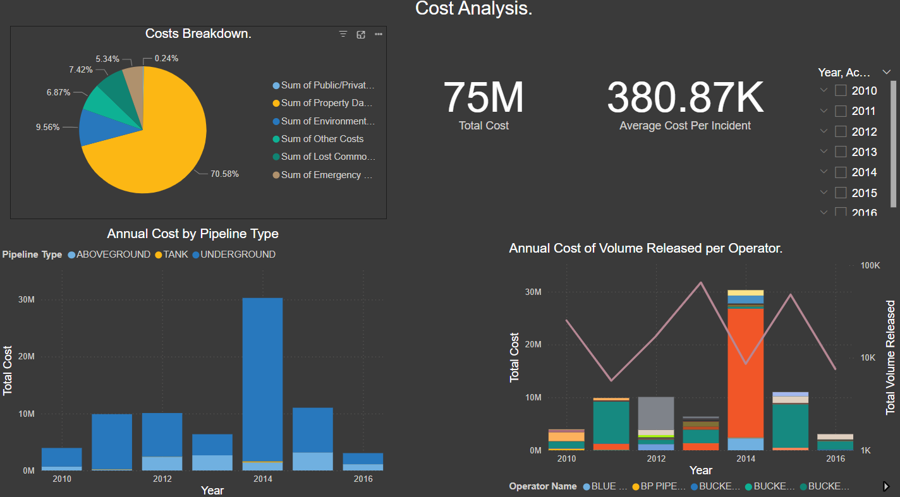
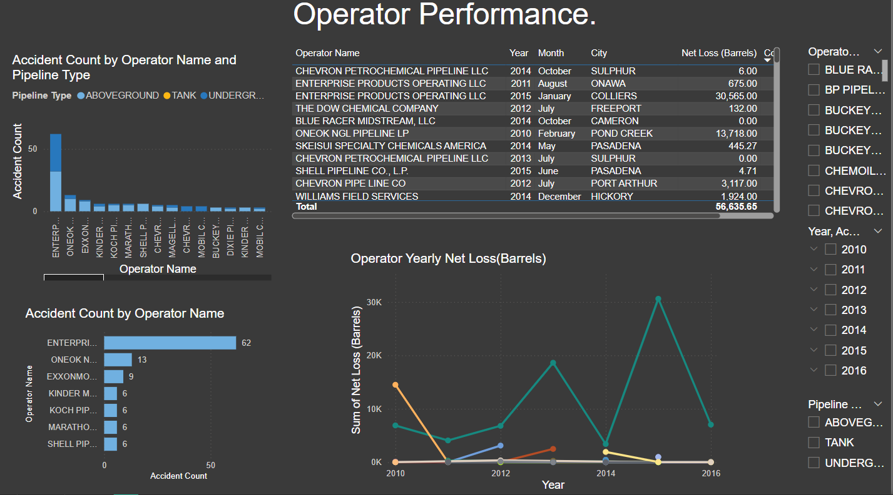

# Pipeline Accidents Dashboard – Power BI

This Power BI project analyzes pipeline accidents across the United States between 2010 and 2016.  
It highlights key trends in accident frequency, cost, causes, and operator performance.

---

## 📁 Data Source

- **Title:** [Pipeline Accidents Dataset – Kaggle](https://www.kaggle.com/datasets/usdot/pipeline-accidents)  
- **Source:** United States Department of Transportation (USDOT)  
- **Years Covered:** 2010 to 2016

---

## 📊 Dashboard Pages and Insights

### Overview Page

**Visuals:**
- Accidents by state (map and bar chart)
- Accident count by liquid type
- Accident count by pipeline type
- Accident causes (pie chart)
- KPIs: total incidents and filters by year

**Insights:**
- Texas reported the highest number of incidents  
- Most accidents involved HVL or other flammable liquids  
- Underground pipelines caused over 60% of accidents  
- Equipment and material failure was the top cause

---

### Cost Analysis Page

**Visuals:**
- Cost breakdown by category
- Annual cost by pipeline type
- Cost and volume released per operator
- KPIs: total cost and average cost per incident

**Insights:**
- Total cost: $75 million  
- Average cost per incident: ~$380,870  
- Over 70% of costs were due to property damage  
- Highest cost spike occurred in 2014

---

### Operator Performance Page

**Visuals:**
- Accidents by operator and pipeline type
- Net loss (barrels) by operator and year
- Table of detailed incidents

**Insights:**
- Enterprise Products Operating LLC had the highest incident count  
- Several operators showed recurring safety issues  
- Total net loss exceeded 56,000 barrels

---

## 🛠 Tools Used

- Power BI Desktop  
- Power Query for data transformation  
- DAX for custom metrics  
- Filters, slicers, and interactivity features

---

## 💡 What I Learned

- Handling real-world accident datasets  
- Structuring multi-page reports in Power BI  
- Using visuals to explain operational risk and cost  
- Applying DAX to calculate totals, averages, and trends

---

## 📷 Dashboard Previews

### Overview  

### Cost Analysis  

### Operator Performance  

---

## 📌 Next Steps

- Add monthly or quarterly trend analysis  
- Include severity classification (if available)  
- Enable drill-through pages with detailed incident views  

